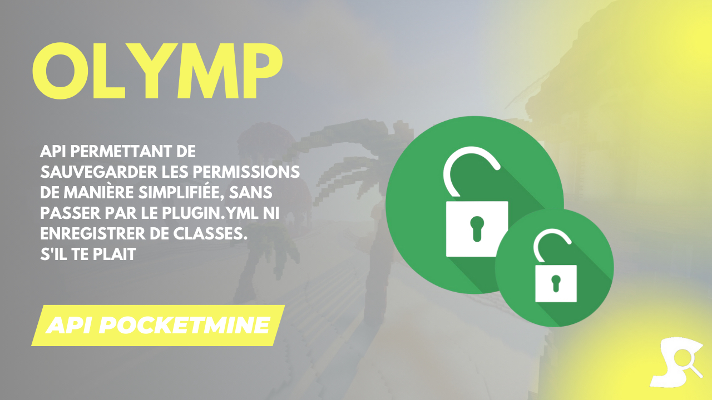

# Olymp-Permission ⛔
API permettant de sauvegarder les permissions de manière simplifiée, sans passer par le plugin.yml ni enregistrer de classes.

## 📦 Installation
- Ajouter le repository dans le fichier ``composer.json``

`````php
composer require synopsie/olymp-permission
`````

---

## 🛠 Usage 
- Créer une instance de ``PermissionManager``

`````php
$manager = new olymp\PermissionManager();
`````

- Création d'une classe enum contenant nos permissions

`````php
enum PermissionsBase : string {
	case PERMISSION_BASE        = "synopsie.permission.base";

	/**
	 * @throws MissingPermissionException
	 */
	public static function getPermission(string $permissionName) : string {
		return match ($permissionName) {
			'base'        => self::PERMISSION_BASE->value,
			default       => throw new MissingPermissionException("Permission $permissionName not found")
		};
	}
}
`````

- Enregistrement de la classe enum :
`````php
$manager->registerEnum(PermissionsBase::cases());
`````

- Création d'une classe contenant les permissions
`````php
class PermissionsBase {
    public const PERMISSION_BASE = "synopsie.permission.base";
}
`````

⚠ **Attention** : Il est impératif que la const commence par ``PERMISSION_``

- Enregistrement de la classe
`````php
$manager->registerClass(new PermissionsBase());
`````

- Enregistrement d'une permission
`````php
$manager->registerPermission("synopsie.permission.base", 'synopsie.base'), DefaultPermissions::ROOT_USER)
`````

- Avoir le type d'un permission
`````php
$manager->getType($string);
`````

